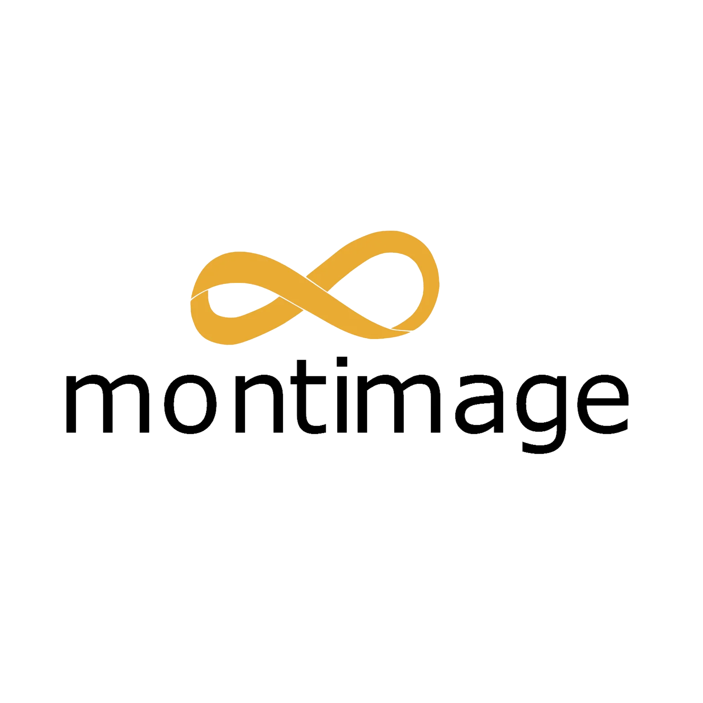

  <picture>
    <source media="(prefers-color-scheme: dark)" srcset="./logo_montimage_square_white.png">
    <source media="(prefers-color-scheme: light)" srcset="./logo_montimage_square_black.png">
    
  </picture>

<h3 align="center">AI-Powered Cybersecurity & Network Intelligence</h3>

  <a href="https://www.montimage.com">Website</a> •
  <a href="https://linkedin.com/company/montimage">LinkedIn</a> •
  <a href="https://github.com/montimage">GitHub</a> •
  <a href="https://huggingface.co/montimage">Hugging Face</a> •
  <a href="https://bsky.app/profile/montimage.bsky.social">Bluesky</a>

---

## About

**Montimage** is a French AI and cybersecurity company founded in 2004, headquartered in Paris. We combine **machine learning**, **deep packet inspection**, and **real-time analytics** to build intelligent security solutions. Our AI-driven tools protect networks, detect advanced threats, and secure critical infrastructure across 5G/6G, IoT, and cloud environments.

## AI & Machine Learning Focus

- **AI-Powered Threat Detection** — ML models for zero-day attacks, anomaly detection, and behavioral analysis
- **AI-Driven Attack Generation** — Using ML/LLMs to craft sophisticated attacks, adversarial samples, and automated exploitation
- **AI Red Teaming & Safety** — Security testing of AI/ML systems, LLM vulnerability assessment, and model robustness evaluation
- **Deep Learning for Network Security** — Neural networks for encrypted traffic classification and intrusion detection
- **LLM & NLP Applications** — Natural language processing for security log analysis and threat intelligence
- **Federated Learning** — Privacy-preserving ML for distributed security monitoring
- **Explainable AI (XAI)** — Transparent and interpretable security decisions

## Core Technologies

- **Deep Packet Inspection** — Real-time analysis of 700+ protocols
- **5G/6G Network Security** — Next-gen mobile infrastructure protection
- **IoT & Edge Security** — Smart device monitoring and threat prevention
- **Attack Simulation & Fuzzing** — Automated vulnerability discovery and exploit generation
- **AI System Security Testing** — Adversarial attacks, prompt injection detection, and AI model hardening
- **Cyber Range & Training** — AI-enhanced simulation environments

## Products

**MMT-DPI** • **MMT-Security** • **MMT-Box** • **MMT-Operator** • **5Greplay**

## Research & Innovation

Active participant in **27 EU-funded research projects** including Horizon Europe and Digital Europe programmes, with strong focus on **AI for cybersecurity**.

**AI-Focused Projects:**
- [AIAGENT4CYBER](https://www.montimage.com/projects/aiagent4cyber) — Agentic AI Assistants for Cyber Defense
- [SECASSURED](https://www.montimage.com/projects/secassured) — AI-based Security Assurance for Trustworthy Engineering
- [DYNABIC](https://dynabic.eu/) — AI-driven cybersecurity for dynamic infrastructure
- [INTACT](https://intact-horizon.eu/) — ML-based IoT-to-Cloud security
- [ENSURE-6G](https://ensure-6g.eu/) — AI-powered 6G network protection

## At a Glance

| 20+ Years | 60+ Publications | 27 Research Projects | AI-First |
|:---------:|:----------------:|:--------------------:|:--------:|
| Research expertise | Peer-reviewed papers | EU-funded | Security approach |

**Partners:** Thales • Orange • Nokia • Ericsson • CEA • SINTEF • Institut Mines-Télécom

---

  <b>Contact:</b> <a href="mailto:contact@montimage.com">contact@montimage.com</a> • Paris, France

